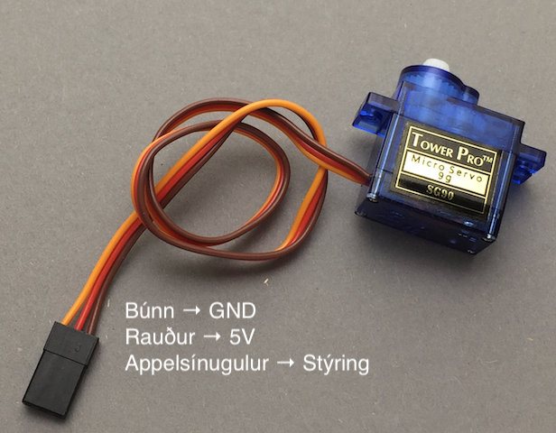

# Lokaverkefni vor 2018
## Eftirlitskerfi

### Verkefnið
Setja á upp öryggiskerfi sem að fylgist með ákveðnu svæði. 
Hlutverk öryggiskerfisins er að koma í veg fyrir að hundurinn komist í kjötstykkið.

Öryggiskerfið á að virka þannig að það er sett nálægt kjötstykkinu og á svo að skanna umhverfið og bregðast við ef að hundurinn kemur ákveðið nálægt kjötinu.
Ef hundurinn kemur t.d. innan 30 cm frá kjötinu á skönnunin að stoppa, kveikja á LED peru og jafnvel gefa frá sér hljóð.

Til að auka notagildi kerfisins þarf að vera hægt að setja það í handvirka stillingu og stjórnast þá skönnunin með stýripinna.
### Íhlutir
* Arduino Uno eða Mega
* Brauðbretti
* UltraSonic skanni (sjá kóðadæmi [hér](../sonic.ino)) 

  
* Servo mótor (sjá kóðadæmi [hér](../servo.ino)) 

  
* Stýripinni (sjá kóðadæmi [hér](../styripinni.ino)) 

  
* Snúrur, viðnám, LED og annað eftir þörfum.

### Dæmi um virkni

